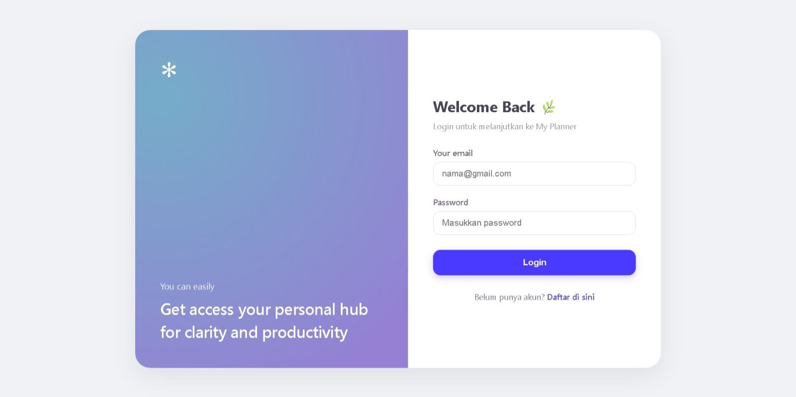
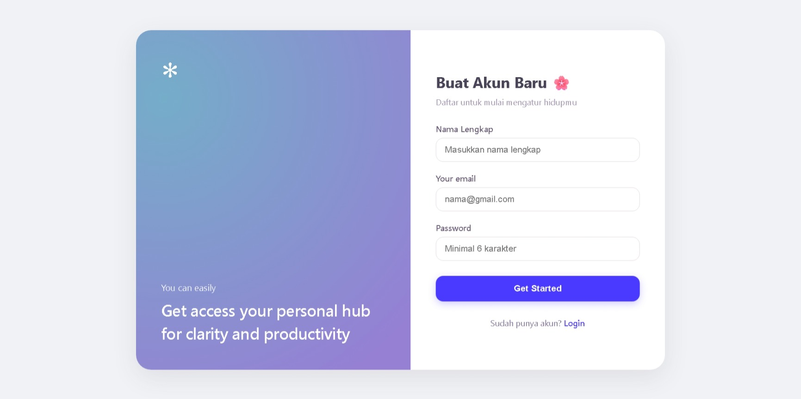
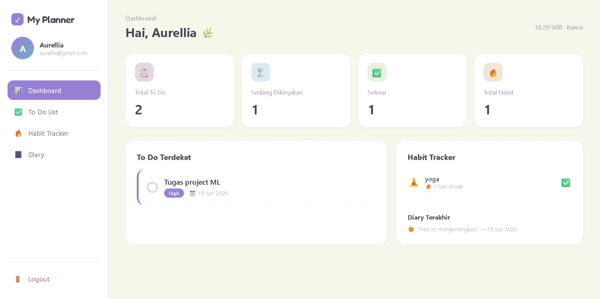
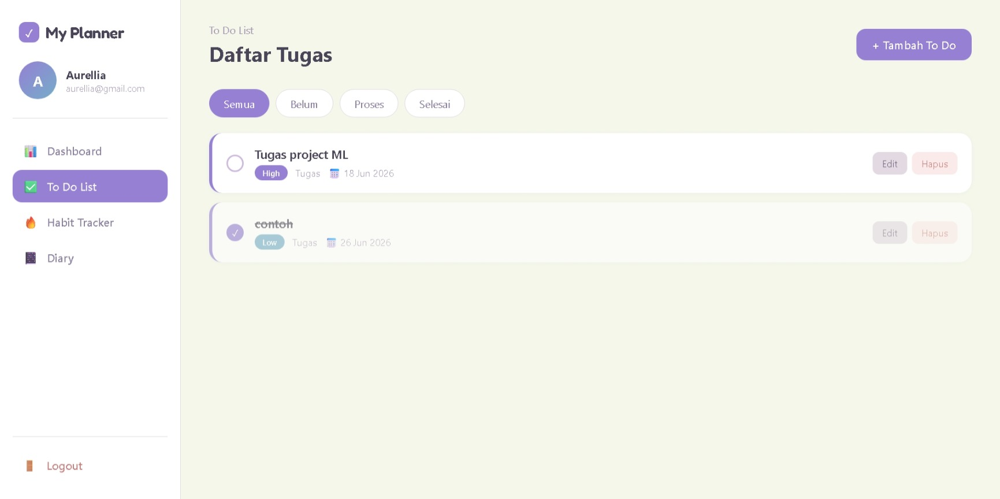
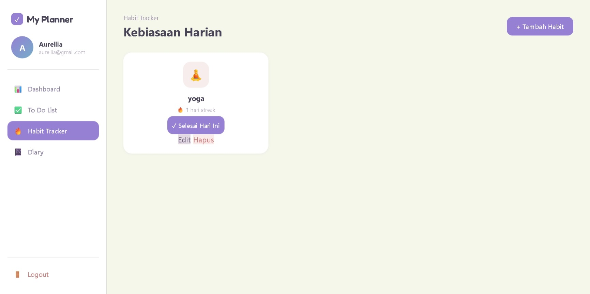

# My Planner

Aplikasi personal planner berbasis web yang dibangun menggunakan PHP Native dan MySQL untuk mengatur tugas harian, kebiasaan, dan catatan diary dalam satu tempat.

## Problem Solving

Aplikasi ini dibuat untuk menyelesaikan masalah utama dalam manajemen kehidupan sehari-hari:

- Mengatasi tugas yang tercecer dengan menyatukannya dalam satu sistem to-do list.
- Membantu membangun konsistensi kebiasaan baik melalui checklist harian dan streak otomatis.
- Menyediakan ruang untuk mencatat perasaan dan momen harian.

## Fungsi Utama

1. **Login & Register**
   - Sistem autentikasi pengguna dengan password yang di-hash menggunakan bcrypt.
   - Setiap pengguna hanya dapat mengakses data miliknya sendiri.

2. **Dashboard**
   - Ringkasan statistik to-do dan habit dalam satu tampilan.

3. **To Do List**
   - CRUD penuh dengan filter status, kategori, prioritas, dan upload file.

4. **Habit Tracker**
   - CRUD habit dengan checklist harian dan penghitungan streak otomatis.

5. **Diary**
   - CRUD catatan harian dengan label mood dan upload foto.

## Teknologi & Tools

- **PHP Native** — logika backend aplikasi.
- **MySQL** — database relasional dengan 5 tabel & relasi Primary/Foreign Key.
- **HTML & CSS (Custom)** — tanpa framework tambahan.

## Struktur Proyek

- `index.php` - Dashboard utama
- `todos.php` - CRUD To Do List
- `habits.php` - CRUD Habit Tracker
- `diary.php` - CRUD Diary
- `login.php` - Halaman login
- `register.php` - Halaman register
- `logout.php` - Proses logout
- `sidebar.php` - Komponen navigasi
- `config/koneksi.php` - Koneksi database
- `functions/helpers.php` - Fungsi bantu
- `database.sql` - Struktur database

## Cara Menjalankan

1. Clone repository ini:
    https://github.com/aurelliafr/my-planner.git

2. Pindahkan folder ke `C:\xampp\htdocs\my-planner`

3. Jalankan Apache & MySQL di XAMPP

4. Import `database.sql` di phpMyAdmin (buat database `my_planner` dulu)

5. Akses di browser:
    http://localhost/my-planner/login.php

6. Login dengan akun berikut, atau daftar akun baru melalui halaman Register:

| Email | Password |
|---|---|
| aurellia@gmail.com | password |

## Informasi Akses Website

Apabila URL utama mengalami peringatan keamanan pada browser tertentu (khususnya Safari/iOS), website dapat diakses langsung melalui:

https://myplanner.great-site.net/login.php

Aplikasi, database, dan seluruh fitur tetap berjalan normal. Perbedaan akses tersebut disebabkan oleh kebijakan keamanan browser terhadap domain hosting gratis yang digunakan.

## Catatan

- Seluruh fitur CRUD (Create, Read, Update, Delete) pada modul To Do List, Habit Tracker, dan Diary telah diimplementasikan secara penuh dan berfungsi.
- Sistem autentikasi (Login & Register) sudah terhubung langsung dengan database menggunakan password hashing (bcrypt).
